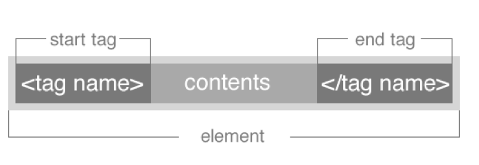

#FEWD - HTML BASICS 

###Justin Steffen

Instructor, General Assembly

---


##Agenda

*	Student Experience
*	Intro To Web Development
*	HTML Tags
*	Lab Time

---


##Student Experience

*	5 Free Passes to GA Workshops
*	Friday Happy Hour 5:30 PM
*	Site Visits (GitHub, AirBnb, LinkedIn, etc.)
*	Free Subscription to Front Row
*	DASH
*	Graduation Party
*	Networking and Friends

---


##Intro To Web Development


---

##Front-End Web Development

Client-Side

*	HTML
*	CSS
*	JavaScript	

---

##Back-End Web Development

Server-Side

*	Ruby
*	PHP
*	Python
*	PERL
*	C++

---


##HTML Tags

---


##General Assembly Press Release

---

##HTML Basics

---


##HTML vs HTML5

HTML5 is HTML with a few additions
The Doctype tells you if the page is HTML5 ready.


```<!DOCTYPE html>```


##HTML HISTORY


<aside class="notes">
image retrieved from http://www.onbile.com/info/wp-content/uploads/2013/09/Timeline-of-web-technologies-639x168.jpg on October 1, 2013.

</aside>

---


##HTML Syntax



---

##HTML Syntax


---

##Content Tags

Heading Elements

```<h1>```Largest Heading```</h1>```

```<h2>``` . . . ```</h2>```

```<h3>``` . . . ```</h3>```

```<h4>``` . . .```</h4>```

```<h5>``` . . . ```</h5>```

```<h6>```Smallest Heading```</h6>```

--

##Content Tags

Text Elements

```<p>```This is a paragraph```</p>```

```<code>```This is some computer code```</code>```

--

##Content Tags

Unordered list

```<ul>``` ```</ul>```

--

##Content Tags

Unordered list item

`
	```<li>```First item```</li>```
    ```<li>```Next item```</li>```


--

##Content Tags

links

 ```<a href="Link">```First item```</a>```


--


##Cookie Recipe

---

## Homework

*	Create a resume website
*	Watch a video about the Internet

---
