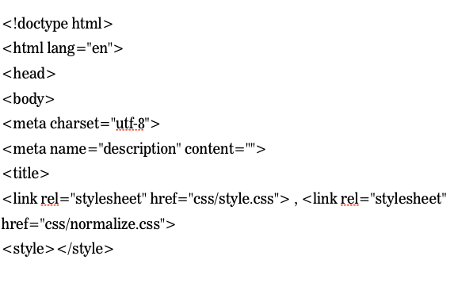

#FEWD - Advanced CSS

###Justin Steffen

Instructor, General Assembly

---

##Agenda

*	Review
*	HTML Template
*	Box Model
*	Nested Selectors
*	Getting Started
*	Lab Time

---

##Review

What do students need help with?

---

##HTML Template

---

##HTML Template

The following are tags that come with the template: 
See starter code for the template.


---

##Box Model

Every element in web design is a box. 

---

##Box Model

---

##Box Model

###Width = width + padding-left + padding-right + border-left + border-right

###Height = height + padding-top + padding-bottom + border-top + border-bottom

---

##Box Model

---

##Nested Selectors

---

##Fashion Blog

---

