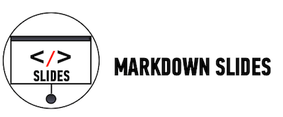

##Lesson 09 - jQuery

###Learning Objectives

*	Utilize jQuery tree traversal techniques to access and manipulate DOM elements.

*	Utilize jQuery Docs to apply functions

###Schedule

| Time        | Topic| GA ICLs| Comments |
| ------------- |:-------------|:-------------------|:----------------|
| 30 min | Intro To jQuery | | What is jQuery and how to add it to your project. |
| 60 min | jQuery Documentation| [Color Switcher]()|  |
| 90 min | Lab Time | [Divided Times]()|  |

###[Homework](../Homework/)

*	Complete Divided Times
*	Complete Carousel
---

##[Color Switcher](http://codepen.io/nevan/pen/dmklG)

###Time: 30 min

| | |
| ------------- |:-------------|
| __Topics__ | jQuery | 
| __Description__| Refactor Color Switcher to use jQuery|   
| __Activity Type__| Code Along | 
 

####Instructional Design Notes

*	Refactor Color Switcher to use jQuery.
*	Show students how to use jQuery documentation. This will help them practice last lesson on functions.

 

##[Divided Times](starter_code/divided-times-nav)

####Time: 90 min

| | |
| ------------- |:-------------|
| __Topics__ | jQuery, programatic thinking, classes, ids, selectors | 
| __Description__| Students add JS & jQuery to a website using jQuery documentation.|    
| __Activity Type__| Paired | 

####Instructional Design Notes 

*	Students will be given the jQuery functions necessary to complete the ask. There job will be to look them up in the jQuery documentation and implement them. 

*	Students should first write pseudo code for the problem and then look up the functions to figure out how to implement.

*	Functions to look up:
	*	.toggleClass()
	*	.hasClass()
	*	.hide()
	*	.show()
	*	.slideUp()
	*	.siblings
	*	.removeClass()
	*	.addClass()

---

click icon for slides.
