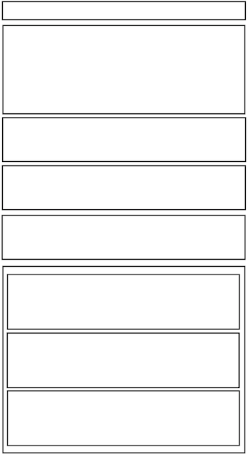

##Boxing 1
####Time: 20 min

| | |
| ------------- |:-------------|
| __Topics__ |Layouts| 
| __Learning Objective__| Review HTML/CSS layouts|    

###Task Instructions

*	Using HTML and CSS recreate the image below. 

##Boxing 2
####Time: 20 min

| | |
| ------------- |:-------------|
| __Topics__ |Mobile Layouts| 
| __Learning Objective__| Describe cascading in CSS.| 

###Task Instructions

*	Add CSS to your file from Boxing 1 to recreate the image below. 

##Media Queries
####Time: 20 min

| | |
| ------------- |:-------------|
| __Topics__ |Mobile Layouts| 
| __Learning Objective__| Be resourceful. You have a basic understanding of media queries, responsive, mobile layouts and __cascading__ style sheets. This exercise challenges your understanding and requires that you Google code snippets and implement media queries to make Boxing_1 responsive. | 

###Task Instructions

*	Your instructor will demo the final result. 
*	Add media queries to make Boxing_1 exercise responsive. 
